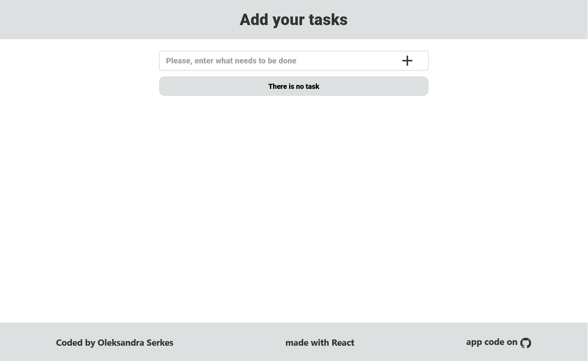
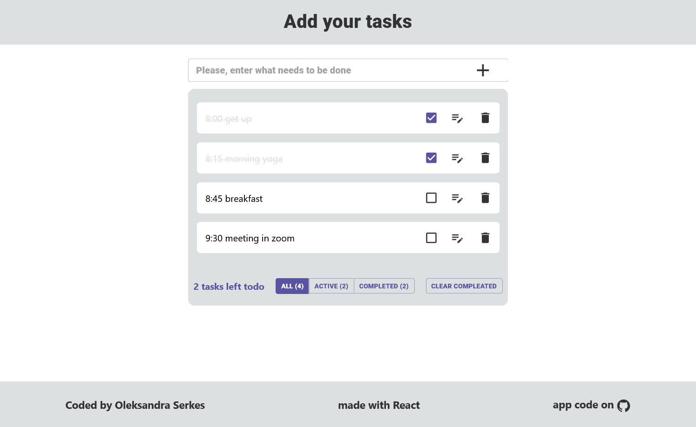
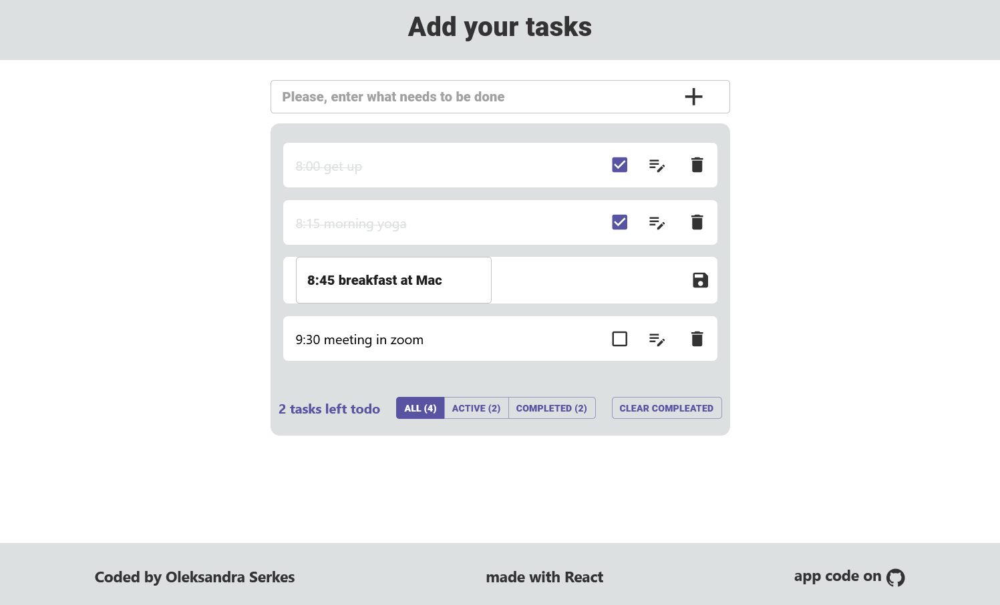
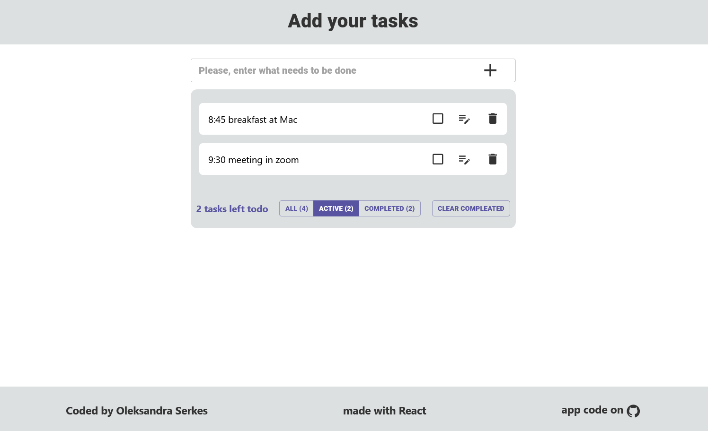
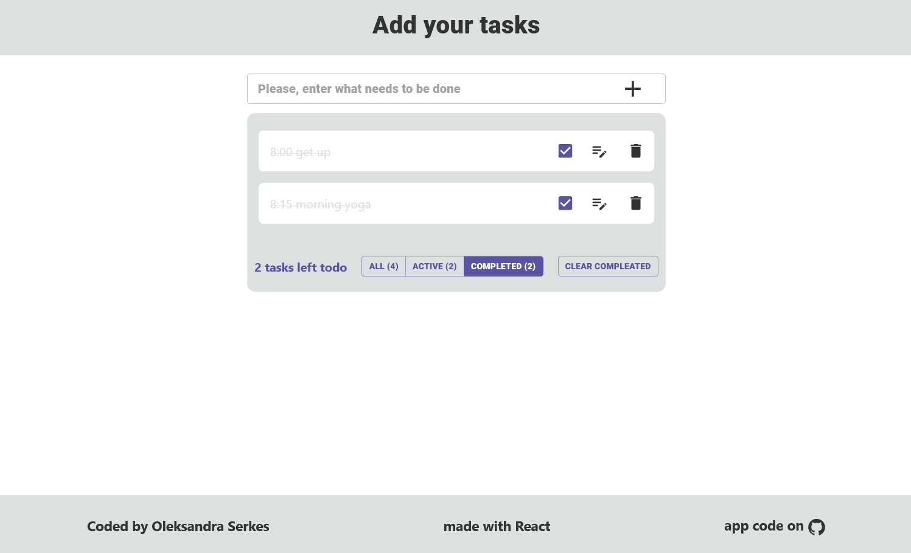

TODO React app solution
This is a solution to the TODO React app.

## Table of contents

- [Overview](#overview)
  - [The task](#the-task)
  - [Screenshot](#screenshot)
  - [Links](#links)
- [My process](#my-process)
  - [Built with](#built-with)
  - [SetUp/Installation instructions](#setUp/installation-instructions)
  - [Useful resources](#useful-resources)
- [Author](#author)

## Overview

### The task

Users should be able to:

- Add their tasks, change them, delete, mark as complited. Users can delete all complited tasks by pushing button "Complited" and see how many tasks left to do.
- Push button:
  - "All" - can see all task they have to do
  - "Active" - can see only active task, can change them and mark as compleated
  - "Compleated" - can see all compleated task, change their status from compleated to active or delete
  - "Clear Compleated" - push and delete every compleated tasks
- View the optimal layout for the interface depending on their device's screen size
- See hover and focus states for all interactive elements on the page

### Screenshot

### Links

- Solution URL: [GitHub Pages](https://github.com/OlSerkes/todoList-react)
- Live Site URL: [Live site URL](https://olserkes.github.io/todoList-react/)

### Built with

- React
- Material UI
- Styled Components

### SetUp/Installation instructions:

- Clone this repository to your desktop
- npm install
- npm start

### Useful resources

- [React Doc](https://react.dev/)
- [material-ui](https://mui.com/material-ui/getting-started/installation/)
- [developer.mozilla.org](https://developer.mozilla.org/en-US/docs/Learn/Tools_and_testing/Client-side_JavaScript_frameworks/React_getting_started)

## Author

- Website - [Oleksandra Serkes](https://github.com/OlSerkes)
- Linkedin - [Oleksandra Serkes](https://www.linkedin.com/in/oleksandra-serkes-65580620a/)
